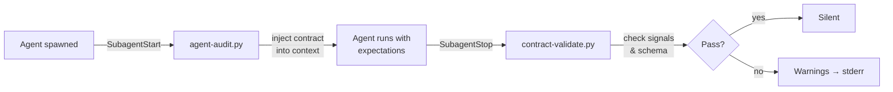

# agent-governance

[](LICENSE)
[](https://python.org)
[](https://docs.anthropic.com/en/docs/claude-code)

Handoff contracts for Claude Code multi-agent workflows. Define what agents must produce, verify they delivered.

## Why

Multi-agent systems fail silently. Agent A spawns Agent B with vague instructions, B returns something unpredictable, A tries to use it. No contract, no validation, no feedback loop.

**agent-governance** adds a `contract:` block to agent frontmatter:

```yaml
contract:
  version: "1.0"
  output_signals:
    - "contains findings with severity levels"
    - "includes specific file paths and line numbers"
```

Two hooks enforce it at runtime:



## Quick start

```bash
# 1. Clone into plugins
git clone https://github.com/t3chn/agent-governance.git ~/.claude/plugins/agent-governance

# 2. Install hooks (SubagentStart + SubagentStop) to settings.json
bash ~/.claude/plugins/agent-governance/setup.sh

# 4. Verify
echo '{"agent_type":"Bash","cwd":"/tmp"}' | python3 ~/.claude/plugins/agent-governance/hooks/agent-audit.py
# → silent (built-in agent, skipped)
```

## Contract format

Add a `contract:` block to any agent's frontmatter (`.claude/agents/*.md`):

### Signal mode (default)

Signals are natural language descriptions of expected output. The hook extracts keywords (4+ chars) and checks that a majority appear in the agent's response — heuristic matching, not semantic analysis.

```yaml
---
name: code-reviewer
description: Reviews code for issues
tools: [Read, Grep, Glob]
contract:
  version: "1.0"
  expects:
    - target_path: "path to review"
  output_signals:
    - "contains findings with severity levels"
    - "includes specific file paths and line numbers"
  limits:
    max_tokens: 30000
---
```

**Writing good signals:** use specific words that would appear in the output. Each signal should have 2+ keywords of 4+ characters.

| Signal | Quality | Why |
|--------|---------|-----|
| `"contains severity assessment with critical/high/medium ratings"` | Good | Clear keywords |
| `"includes file paths and line numbers for each finding"` | Good | Specific terms |
| `"has output"` | Bad | No extractable keywords |

### Structured mode

For machine-readable output, set `output_mode: structured`. The agent wraps key data in an HTML comment:

```
<!-- CONTRACT_OUTPUT {"findings": [...], "severity_summary": {...}} -->
```

The hook validates required fields and types against `output_schema`:

```yaml
contract:
  version: "1.0"
  output_mode: structured
  output_schema:
    required: [findings, severity_summary]
    properties:
      findings:
        type: array
      severity_summary:
        type: object
  output_signals:
    - "includes severity assessment"
```

Validation uses `jsonschema` if installed, falls back to manual required-field checks.

### External contracts

For complex contracts, reference a separate file:

```yaml
---
name: my-agent
contract_ref: ./contracts/reviewer-contract.md
---
```

## How it works

| Hook | Event | Source | What it does |
|------|-------|--------|--------------|
| `agent-audit.py` | SubagentStart | `settings.json` | Finds agent `.md` → parses `contract:` → injects expectations via `additionalContext` |
| `contract-validate.py` | SubagentStop | `settings.json` | Checks output signals + structured schema → warnings to stderr |

Both hooks are installed to `settings.json` by `setup.sh`. Plugin hooks can't inject `additionalContext` ([#16538](https://github.com/anthropics/claude-code/issues/16538)) and local plugin discovery is unreliable, so `settings.json` is the reliable path for both.

Built-in agents are skipped: Bash, Explore, Plan, Task, general-purpose, code-simplifier, code-reviewer, code-explorer, code-architect, statusline-setup, claude-code-guide.

## Design decisions

- **Non-blocking.** Both hooks always exit 0. Warnings go to stderr, never prevent agent completion. This is a deliberate trade-off: contracts improve signal quality, not enforce correctness gates.
- **Stdlib only.** No pip install required. Optional `jsonschema` for richer validation.
- **Heuristic matching.** Signal mode uses keyword extraction, not LLM-based semantic comparison. Fast, predictable, zero API cost.

## Structure

```
.claude-plugin/plugin.json     Plugin manifest
hooks/hooks.json               SubagentStop hook config
hooks/lib_contract.py          Shared: discovery, parsing, validation
hooks/agent-audit.py           SubagentStart context injection
hooks/contract-validate.py     SubagentStop output validation
skills/agent-contracts/        Documentation skill for Claude Code
setup.sh                       Install/uninstall SubagentStart hook
```

## Uninstall

```bash
bash ~/.claude/plugins/agent-governance/setup.sh --uninstall
```

## Debugging

Logs: `/tmp/agent-governance-debug.log`

| Issue | Fix |
|-------|-----|
| No validation running | Check plugin is enabled + `setup.sh` was run |
| Signals always fail | Use specific keywords (4+ chars), check the log for extracted keywords |
| Structured output not found | Agent must include `<!-- CONTRACT_OUTPUT {...} -->` in response |

## Requirements

- Python 3.8+
- Zero required dependencies (stdlib only, optional `jsonschema`)
- Claude Code with plugin support

## License

MIT
